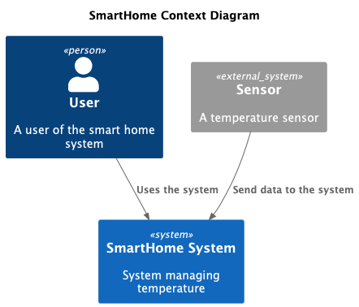
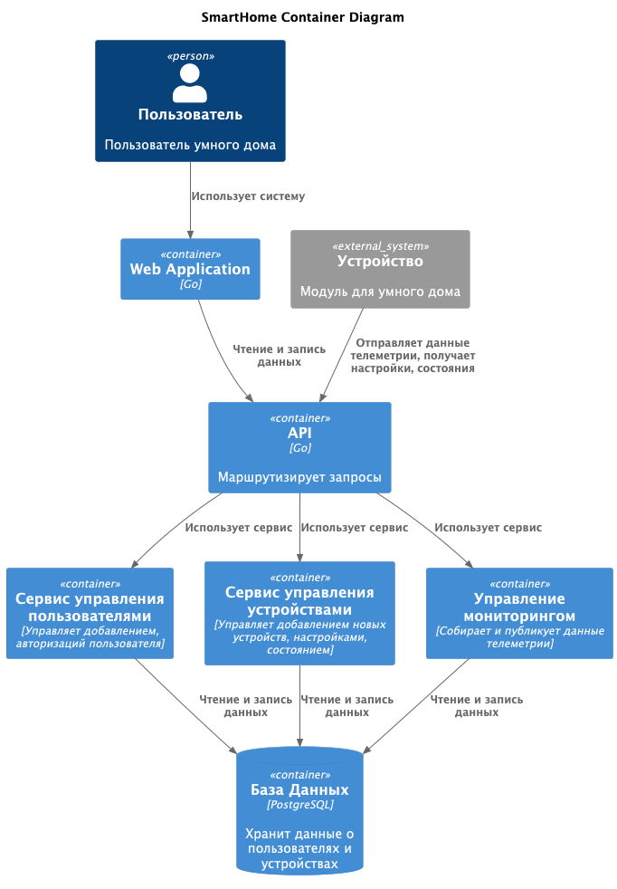
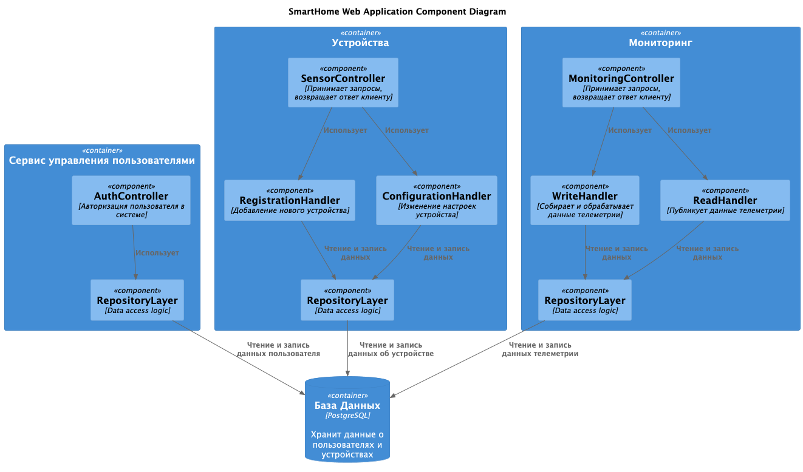
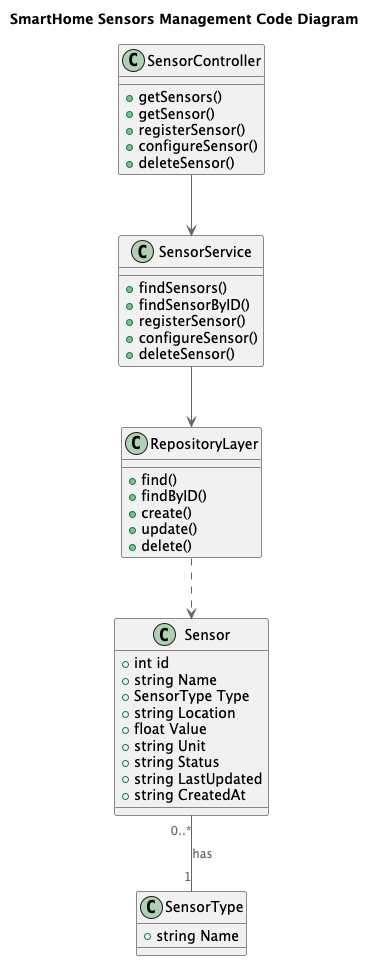
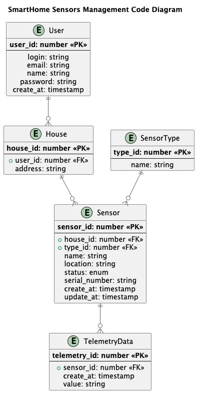

# Project_template

# Задание 1. Анализ и планирование

### 1. Описание функциональности монолитного приложения

**Управление отоплением:**

- Пользователи могут удалённо включать/выключать отопление в своих домах
- Система поддерживает управление отоплением по настройкам

**Мониторинг температуры:**

- Пользователи могут просматривать текущую температуру в своих домах через веб-интерфейс
- Система получает данные о температуре с датчиков, установленных в домах

### 2. Анализ архитектуры монолитного приложения

- Язык программирования: Go
- База данных: PostgreSQL
- Архитектура: Монолитная, все компоненты системы (обработка запросов, бизнес-логика, работа с данными) находятся в
  рамках одного приложения.
- Взаимодействие: Синхронное, запросы обрабатываются последовательно.
- Масштабируемость: Ограничена, так как монолит сложно масштабировать по частям.
- Развертывание: Требует остановки всего приложения.

### 3. Определение доменов и границы контекстов

- Домен: устройства
    - поддомен управление устройствами
        - *(To-Be) контекст: добавления устройства в систему*
        - *(To-Be) контекст: настройка устройства*
        - контекст: изменение состояния (включение\выключение)

- Домен: мониторинг
    - поддомен сбора телеметрии
        - контекст: сохранение телеметрии
    - поддомен отображения телеметрии
        - контекст: публикация телеметрии

- Домен: пользователи
    - поддомен авторизации

### **4. Проблемы монолитного решения**

Приложение небольшое, с очень ограниченным набором функций, поэтому монолитное решение вполне подходит.
Но с развитием и добавлением нового функционала появятся проблемы
с масштабированием, совместной работы команды над разными частями приложения,
увеличится риск ошибок.

### 5. Визуализация контекста системы — диаграмма С4

[Диаграмма контекста](diagrams/context.puml)

# Задание 2. Проектирование микросервисной архитектуры

**Диаграмма контейнеров (Containers)**

[Диаграмма контейнеров](diagrams/container.puml)

**Диаграмма компонентов (Components)**

[Диаграмма компонентов](diagrams/component.puml)

**Диаграмма кода (Code)**

[Диаграмма кода](diagrams/code.puml)

# Задание 3. Разработка ER-диаграммы

[ER-диаграмма](diagrams/er.puml)

# Задание 4. Создание и документирование API

### 1. Тип API

REST API больше подходит для большинства запросов на получение и обновление данных.

AsyncAPI может быть использовано в приложении, например, для сбора телеметрии.

### 2. Документация API

[API docs](swagger/api-docs.yaml)

